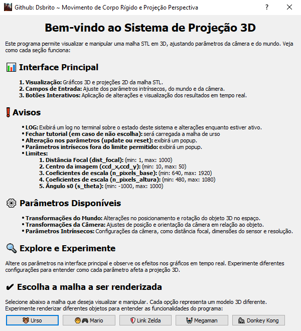
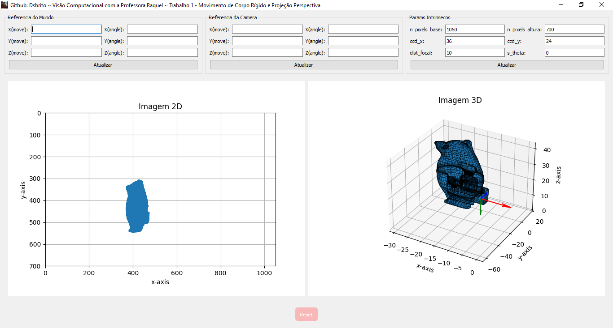

# **Sistema de Projeção 3D com Visualização STL**

Este projeto é um sistema interativo que permite a visualização e manipulação de projeções 3D de malhas STL, utilizando ajustes de parâmetros intrínsecos e extrínsecos. Com uma interface amigável construída com PyQt5, o programa facilita a experimentação e análise dos efeitos de projeções no espaço tridimensional.

---

## **📊 Funcionalidades**

- **Carregamento de Malhas STL**:
  - Visualize objetos 3D diretamente na interface.
- **Ajustes de Parâmetros**:
  - Modifique os parâmetros da câmera e do objeto para explorar diferentes projeções.
- **Transformações em Tempo Real**:
  - Ajuste posição, rotação e escala da câmera ou do objeto e visualize as alterações imediatamente.
- **Visualização Gráfica**:
  - Gráficos 3D da malha e sua projeção 2D no espaço.
- **Tutorial Interativo**:
  - Uma seção dedicada a ajudar novos usuários a entender como operar o sistema.

---

## **📂 Estrutura do Projeto**

```plaintext
rigid-motion-projection/
│
├── assets/
│   ├── img/
│   │   └── icon.png
│   ├── logs/
│   └── stl/
│       ├── donkey_kong.STL
│       ├── link_zelda.STL
│       ├── mario.STL
│       ├── megaman.STL
│       └── urso.STL
│
├── src/
│   ├── camera/
│   │   ├── camera.py
│   │   └── initialize_camera.py
│   ├── intrinsic/
│   │   └── intrinsic_config.py
│   ├── plot/
│   │   └── plot.py
│   ├── reset/
│   │   └── reset_config.py
│   ├── utils/
│   │   ├── load_stl.py
│   │   └── transformations.py
│   │   └── tutorial_popup.py
│   ├── world/
│       └── world_config.py
│
├── main.py
├── readme.md
```
## **❗ Pré-requisitos**
- Python 3.8 ou superior.
-  Principais Bibliotecas necessárias (Pode precisar de outras):
   ```bash
    pip install PyQt5
    pip install matplotlib
    pip install numpy-stl
    ```
---

## **🔧 Como Configurar**

1. **Clone o Repositório**:
   ```bash
   git clone https://github.com/DsBrito/rigid-motion-projection.git
   ```
2. **Execute o Programa**:
   ```bash
   cd rigid-motion-projection
   python main.py
   ```

---

## **🚀 Como Usar**

1. **Carregue uma Malha STL**:
   - Use o botão correspondente para carregar seu arquivo `.stl`.
2. **Ajuste os Parâmetros**:
   - Insira os valores nos campos para configurar a câmera e as transformações.
3. **Visualize os Resultados**:
   - Acompanhe as alterações no gráfico e no log em tempo real.

### **Interface Principal**

- **Gráficos 3D**: Mostram a visualização da malha STL em perspectiva.
- **Projeção 2D**: Demonstra como o objeto é projetado no plano.
- **Campos de Entrada**: Ajuste parâmetros da câmera, rotação e posicionamento.

---

## **💡 Dicas de Uso**

- Consulte o **Tutorial** integrado para se familiarizar com o projeto.
- Experimente diferentes valores para observar como cada parâmetro influencia a projeção.
- Para evitar erros, insira apenas números válidos nos campos.
- Acompanhe o log no terminal.

---

## **💡 Em execução**

- Tutorial
<div style="display: inline_block" align="center">

  </div>


- Interface
<div style="display: inline_block" align="center">

  </div>


## **🛠️ Desenvolvido com**

- **[PyQt5](https://www.riverbankcomputing.com/software/pyqt/intro)**: Para criação da interface gráfica.
- **[Matplotlib](https://matplotlib.org/)**: Para renderização dos gráficos.
- **[numpy](https://numpy.org/)**: Para manipulação de dados matemáticos.
- **[scipy](https://scipy.org/)**: Para cálculos científicos e matemáticos.
- **[numpy-stl](https://pypi.org/project/numpy-stl/)**: Para manipulação de arquivos STL.

---

## **👩‍💻 Contribuindo**

1. Faça um fork do projeto.
2. Crie uma branch para sua feature:
   ```bash
   git checkout -b minha-nova-feature
   ```
3. Commit suas mudanças:
   ```bash
   git commit -m "Adiciona nova feature"
   ```
4. Faça um push para a branch:
   ```bash
   git push origin minha-nova-feature
   ```
5. Abra um Pull Request.

---

## **📜 Licença**

Este projeto é licenciado sob a [MIT License](LICENSE).

---

## **📞 Contato**

Caso tenha dúvidas ou sugestões, entre em contato:

- **Nome**: Dionatas Santos Brito
- **Instagram**: @dssbrito
- **Gmail**: dsbrito.dev@gmail.com
- **GitHub**: [DsBrito](https://github.com/DsBrito)
